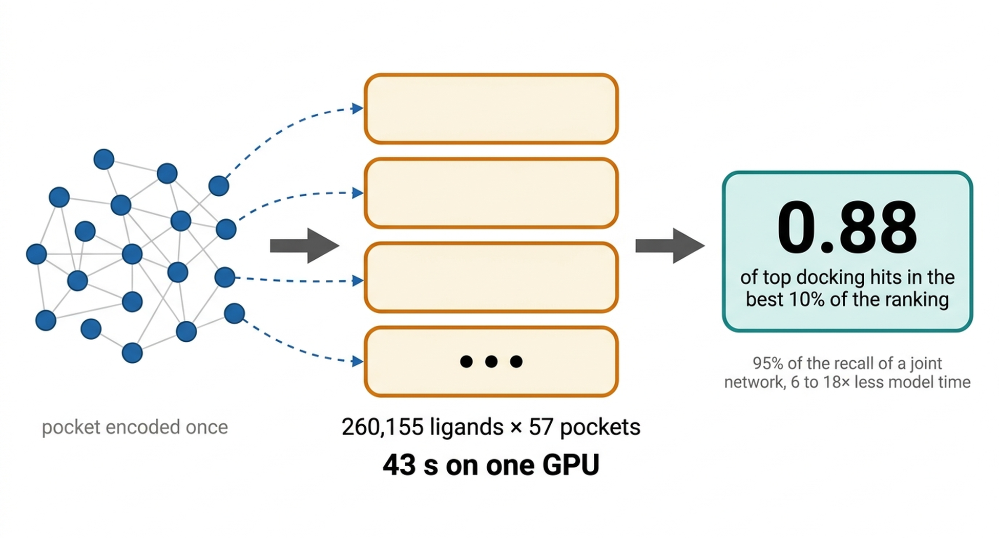
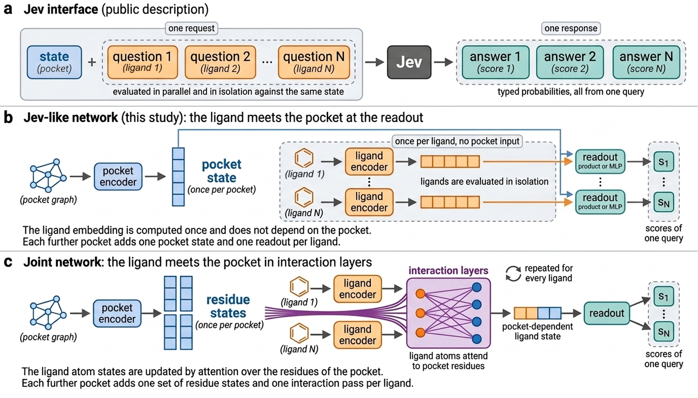
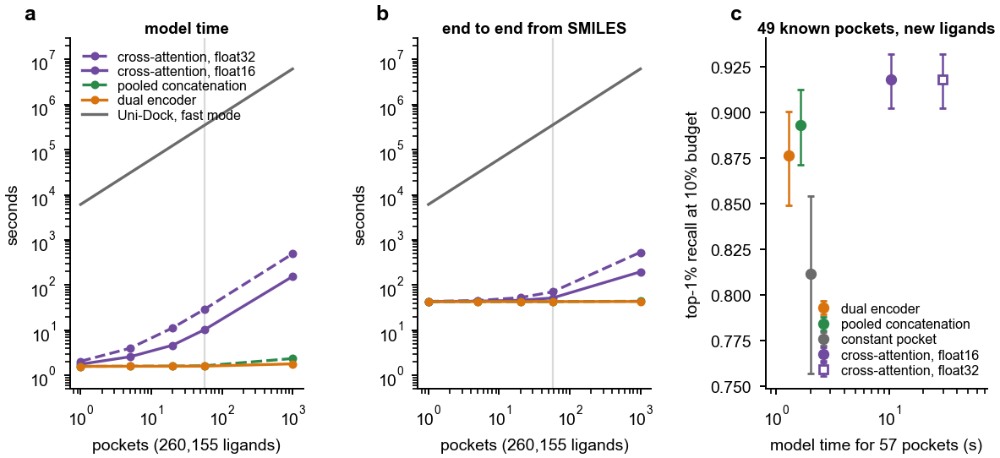

# Jev-Like Shared-State Networks for Fast Structure-Based Screening

Code and data for the manuscript by Hyunseung Kong, Interdisciplinary Program in Bioinformatics, Seoul National University.

## Summary

Docking a large library against many pockets is limited by the cost of the calculation. A Jev-like network encodes each pocket once into a shared state and scores every ligand against it independently, so that a screen of a library against many pockets reduces to a matrix product. On the 49 known pockets of DOCKSTRING, a dual encoder and a pooled network of this organization recover 0.88 and 0.89 of the top-1% docking hits of new ligands in the best 10% of the ranking, against 0.92 for a cross-attention network. On one RTX 4090 the dual encoder ranks 260,155 ligands against 57 pockets from SMILES in 43 s. The cross-attention network needs 6.4 to 18 times the model time of the dual encoder for 57 pockets and 86 to 273 times for 1,000 pockets. The networks serve the pockets of their training data.

## Figures

**Figure 1.** The Jev interface (a), the Jev-like network (b) and the joint cross-attention network (c).

**Figure 2.** Model time against the number of pockets (a), the same from SMILES (b), and recall against model time (c).

## Contents

- `manuscript/`: LaTeX sources of the manuscript and the Supporting Information, and the figures.
- `code/`: scripts and the `pocketgate` library.
- `eval/`: evaluation outputs and timing records.
- `data/`: data splits and cross-validation folds.
- `results/`, `poses/`, `plan/`, `runs/`: DockMut-1 docking data and training curves used in the Supporting Information. `DOCKMUT1.md` describes them and the layout of the archive.
- Checkpoints and the pocket graph cache are too large for the git tree. They are in `DockMut_release.zip` under Releases (v1.0), together with all other files. `SHA256SUMS.json` lists the hash of every file.

## Data and license

DOCKSTRING receptors, ligands and scores come from https://github.com/dockstring/dockstring (Apache License 2.0). This repository is released under the Apache License 2.0.

## Contact

Hyunseung Kong, hskong@snu.ac.kr
